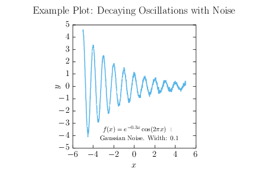

## Overview
A lightweight pipeline for generating publication-quality plots from gnuplot with consistent LaTeX formatting. Very useful for uniform plotting for collaborations/bigger projects.

## Repository Layout
```plaintext
├── example/
├── style/
├── pdfs/
├── fix.py
├── Makefile
```
- `example/`: Example directory showcasing a decaying oscillation plot.
- `style/`: Stores shared gnuplot styles, terminals, and reusable plotting components. These are included by the Makefile but excluded from make clean.
- `pdfs/`: Output directory for final PDFs.
- `fix.py`: Post-processes gnuplot cairolatex LaTeX output to enforce consistent formatting across plots.
- `Makefile`: Recursively searches subdirectories for matching .gnu and .dat file pairs and runs the full plotting pipeline.
This structure is designed to make adding new plots as simple as dropping in a .gnu and .dat file pair.

## How It Works
The MakeFile searches all subdirectories (that are not style and pdfs), looks for a pair of files: NAME.dat and NAME.gnu. These must share the same NAME. It is done this way so you can have special .gp files that house other gnuplot objects and they will be unaffected by make clean.

It then runs the gnuplot script, takes the outputted tex file, and runs that through the fix.py script. The fix.py script post-processes the generated TeX to make uniform several aspects of cairolatex output: text coloring consistency, scientific notation formatting on tick labels, and font sizing for titles and axis labels.   

This is a lightweight, opinionated workflow designed to simplify producing consistent plots. It may not cover all use cases, but has been useful for maintaining uniform styling across projects.

## In This Repository
Included in this repository is an example/ directory. You can go in and edit the generate_data.py as you see fit to generate other curves; generate_data.py exists only to generate the example data and is not required for other directories. 

## Usage
Go into this base directory and run "make" and see the output in the pdfs/ directory. Unless the user edits the data function, the expected output will be a "example.pdf" file in the pdfs/ directory showcasing the labeling and a decaying oscillation wave.

To add a new plot, create a directory adjacent to example/. Inside it, place two files 
with matching names: NAME.gnu (your gnuplot script) and NAME.dat (your data in 
space-separated "x y" format). Run make from the base directory and the output will 
appear in pdfs/.

## Expected Output
The expected output from the example/ directory is as follows:


## Dependencies
- gnuplot
- pdflatex
- Python 3 (numpy, os, sys, re, subprocess)