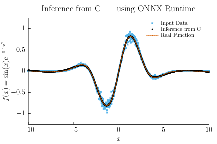

### Overview
A project that takes a simple model in PyTorch to learn $f(x) = \sin(x)e^{-0.1x^2}$, 
exports it to ONNX, and performs inference in C++ via ONNX Runtime (ORT) - demonstrating how a 
trained model can be deployed in a performance-critical environment without a Python 
runtime dependency. As well, explicit comparisons between per sample and batched inference in ORT are performed. Results are visualized using [gnuplot-latex-utils](https://github.com/ksalamone59/gnuplot_latex_utils), producing 
publication-ready plots directly from C++ output. Tested with ORT 1.22.1. 

## Key Results
### ORT Inference vs Input Data vs True Function

- Using the output from ORT inferencing in C++ 
- Plots: 
    - Heteroscedastically noisy input data (blue squares)
    - C++ Inference (black circles)
    - Truth function (dashed orange)
- Observations:
    - Despite being trained on heteroscedastic noisy data, the model accurately recovers the underlying function when evaluated via ONNX Runtime (C++) inference, achieving $R^{2}=0.998$ against the true function
### Per Sample vs Batched Inference Comparisons
- In the `benchmark.cpp` file, we evaluate the runtime behavior of the inferencing in Ort in two ways:
    - Repeated single-sample execution (`Ort::Session::Run()` called N times) and 
    - Single batched execution over N samples 
- Throughput is calculated as total processed samples / mean iteration time 
- Per Sample (sequential `Run()` calls over 1000 inputs):
    - Mean iteration time: $1.73 \pm 0.13$ ms
    - Throughput: $579324 \pm 42653$ samples/s
- Per Batch (single `Run()` call on 1000 inputs):
    - Mean iteration time (1 batch of 1k samples): $0.11 \pm 0.02$ ms
    - Throughput: $9.41 \pm 1.53$ million samples/s
- Implication: batched input showcases $\sim16\times$ speedup under this measurement configuration
- There are some overhead differences between the two implementations, including:
    - Repeated per-call inference overhead 
    - Repeated calling of `Ort::Session::Run()` 1k times 
    - Lack of execution graph amortization via batching
- Timing variations is expected due to effects such as CPU scheduling and the cache state


## Repository Layout 
```plaintext 
├── python/
├── cpp/
├── model_files/
├── python_figures/
├── Plotting/
├── Makefile
├── requirements.txt
├── LICENSE
```

- `python/`: Directory with generate_model.py; the script used to generate the data for, and train, the main model. It also exports the model to .onnx and .pth formats, and quantifies the performance of the model on various datasets.
- `cpp/`: Directory where the C++ code for inference lies, ort_inference_from_model.cpp. Includes a CMakeLists.txt where you can compile the directory by creating a build directory then running `cmake -DONNXRUNTIME_DIR="/path/to/ONNXRunTime"`. Executable will be named onnx_inference. However, the Makefile will handle this should the user want less interfacing.

    One can also run benchmarking of per point inferencing vs per batch inferencing in ORT. This code is stored in `benchmark.cpp`. You do this either by using the makefile (below) or by running the `onnx_benchmark` executable after running cmake and make.
- `model_files/`: Directory that stores output from generate_model.py, both .pth and .onnx files are stored here.
- `python_figures/`: Output directory for all matplotlib figures generated within generate_model.py. Includes figures like loss curves, residuals, truth vs noisy input, noisy input vs model predictions, etc.
- `Plotting/`: Directory containing [gnuplot-latex-utils](https://github.com/ksalamone59/gnuplot_latex_utils) as a submodule. Automatically stores output from C++ inference into the Plotting/ort_inference directory. The Makefile that exists here will automatically run the plotting scripts. Please see the original documentation for more information.
- `Makefile`: Runs the pipeline in order: from the python model generation and plot creation, to the C++ inference, to creating the final output. The input expected is `make ORT_DIR=/path/to/ONNXRunTime/`. Note: `make clean` will delete the model files as well for completeness. You can run `make benchmark_cpp ORT_DIR=/path/to/ONNXRunTime/` to run the benchmarking code from `benchmark.cpp`.
- `LICENSE`: MIT License for this repo 
- `requirements.txt`: requirements for this repository in python. Can run `pip install requirements.txt` for simplicity.

### How to Run the Code
- Run git submodule update --init --recursive
- Run `make ORT_DIR=/path/to/ONNXRunTime` from the base directory.
- The python output plots are stored in `python_figures` and the final C++ inference is stored in `Plotting/pdfs/ort_inference.pdf`

### Dependencies 
- For python3:
    - python3-dev (python3 >= 3.10)
    - numpy 
    - PyTorch 
    - tqdm
    - scipy
    - matplotlib
    - onnxruntime 
- ONNXRunTime C++ API, tested with 1.22.1
    - I installed it from [here](https://www.nuget.org/api/v2/package/Microsoft.ML.OnnxRuntime/1.22.1)
- CMake
- C++17 or later
- gnuplot and pdflatex (see [gnuplot-latex-utils](https://github.com/ksalamone59/gnuplot_latex_utils) for details)